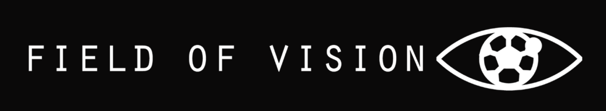

<!-- # SWENG-2021-GROUP21-FIELD_OF_VISION
Github repository for Software Engineering Group 21 (2021). -->

<p align="center">

</p>

<!-- PROJECT SHIELDS -->
<!--
*** I'm using markdown "reference style" links for readability.
*** Reference links are enclosed in brackets [ ] instead of parentheses ( ).
*** See the bottom of this document for the declaration of the reference variables
*** for contributors-url, forks-url, etc. This is an optional, concise syntax you may use.
*** https://www.markdownguide.org/basic-syntax/#reference-style-links
-->
[![Contributors][contributors-shield]][contributors-url]
[![Forks][forks-shield]][forks-url]
[![Stargazers][stars-shield]][stars-url]
[![Issues][issues-shield]][issues-url]
[![LinkedIn][linkedin-shield]][linkedin-url]
<!-- [![MIT License][license-shield]][license-url] -->


<!-- PROJECT LOGO -->
<br />
<p align="center">
  <a href="https://github.com/andymcdonald99/SWENG-2021-GROUP21-FIELD_OF_VISION">
    
  </a>

  <h3 align="center">SWENG-2021 GROUP21 - FIELD OF VISION</h3>

  <p align="center">
    Github repository for Software Engineering Group 21 (2021).
    <br />
  </p>
</p>


<!-- TABLE OF CONTENTS -->
<details open="open">
  <summary><h2 style="display: inline-block">Table of Contents</h2></summary>
  <ol>
    <li>
      <a href="#about-the-project">About The Project</a>
      <ul>
        <li><a href="#built-with">Built With</a></li>
      </ul>
    </li>
    <li>
      <a href="#getting-started">Getting Started</a>
      <ul>
        <li><a href="#prerequisites">Prerequisites</a></li>
        <li><a href="#installation">Installation</a></li>
      </ul>
    </li>
    <li><a href="#contact">Contact</a></li>
  </ol>
</details>


<!-- ABOUT THE PROJECT -->
## About The Project
Github repository for Software Engineering Group 21 (2021)

**App Demo :**
<p align="center">

</p>
<!--  -->
<!-- [![Product Name Screen Shot][product-screenshot]](https://example.com) -->


### Built With

* [Flutter](https://flutter.dev/docs/get-started/install)
* [Android Studio](https://developer.android.com/studio)
<!-- * scope to add more in future
* []() -->


<!-- GETTING STARTED -->
## Getting Started

To get a local copy up and running follow these simple steps.

### Prerequisites

You need to have [**flutter**](https://flutter.dev/docs/get-started/install) installed. 
You also need an *android* or an *iOS simulator* to be able to run the app.

### Installation

1. Clone the repo
   ```sh
   git clone https://github.com/andymcdonald99/SWENG-2021-GROUP21-FIELD_OF_VISION
   ```
2. Move into the app directory
   ```sh
   cd fov_app
   ```
3. Run the app
   ```sh
   flutter run
   ```

_For more examples, please refer to the [Official Website](https://fov.ie/)_


<!-- LICENSE
## License

If we ever choose to license this. -->


<!-- CONTACT -->
## Contact

Andy    - `mcdonaa6@tcd.ie`</br>
Luke    - `mcgratlu@tcd.ie`</br>
Deneher - `ddeneher@tcd.ie`</br>
Andrew  - `mandrew@tcd.ie`</br>
Aislinn - `addisona@tcd.ie`</br>
John    - `kommalaj@tcd.ie`</br>


<!-- MARKDOWN LINKS & IMAGES -->
<!-- https://www.markdownguide.org/basic-syntax/#reference-style-links -->
[contributors-shield]: https://img.shields.io/github/contributors/andymcdonald99/SWENG-2021-GROUP21-FIELD_OF_VISION.svg?style=for-the-badge

[contributors-url]: https://github.com/andymcdonald99/SWENG-2021-GROUP21-FIELD_OF_VISION/graphs/contributors

[forks-shield]: https://img.shields.io/github/forks/andymcdonald99/SWENG-2021-GROUP21-FIELD_OF_VISION.svg?style=for-the-badge

[forks-url]: https://github.com/andymcdonald99/SWENG-2021-GROUP21-FIELD_OF_VISION/network/members

[stars-shield]: https://img.shields.io/github/stars/andymcdonald99/SWENG-2021-GROUP21-FIELD_OF_VISION.svg?style=for-the-badge

[stars-url]: https://github.com/andymcdonald99/SWENG-2021-GROUP21-FIELD_OF_VISION/stargazers

[issues-shield]: https://img.shields.io/github/issues/andymcdonald99/SWENG-2021-GROUP21-FIELD_OF_VISION.svg?style=for-the-badge

[issues-url]: https://github.com/andymcdonald99/SWENG-2021-GROUP21-FIELD_OF_VISION/issues

[license-shield]: https://img.shields.io/github/license/andymcdonald99/SWENG-2021-GROUP21-FIELD_OF_VISION.svg?style=for-the-badge

[license-url]: https://github.com/andymcdonald99/SWENG-2021-GROUP21-FIELD_OF_VISION/blob/master/LICENSE.txt

[linkedin-shield]: https://img.shields.io/badge/-LinkedIn-black.svg?style=for-the-badge&logo=linkedin&colorB=555

[linkedin-url]: https://www.linkedin.com/company/f-o-v/about/
